<div align="center">
  <h1>🔍 AWS Event-Driven Invoice Processing Pipeline</h1>
  <p><strong>An intelligent, event-driven serverless pipeline that automates invoice ingestion, extracts financial metadata, validates taxes, flags compliance anomalies using AI, and hosts a premium reviewer dashboard.</strong></p>
</div>

---

## 🏗️ Architecture & E2E Workflow

The following architecture diagram represents the 5-stage pipeline, from ingestion to human review.



---

## 🌟 Key Features

1. **Multi-Channel Ingestion**: Automatically extracts attachments from emails via Amazon SES or manual dashboard uploads.
2. **AI Document Understanding**: Uses Amazon Textract `AnalyzeExpense` for deep OCR extraction of fields, line items, and taxes.
3. **Claude 3 Validation**: Runs an LLM-based audit on extracted JSON to detect amount mismatches, invalid GSTIN tags, duplicate submissions, and vendor anomalies.
4. **Resilient Orchestration**: Implements AWS Step Functions with automated retries (3x backoff) and escalates timeouts (72-hour limits) to SNS alert topics.
5. **Human-in-the-Loop Web Dashboard**: Sleek React/Vite dashboard built using TailwindCSS and modern UI primitives, supporting PDF side-by-side previews, exception listings, audit trails, and KPI metrics.

---

## 📂 Project Structure

```text
├── backend/
│   ├── lambdas/
│   │   ├── invoice-ingestion/    # Receives uploads and emails
│   │   ├── textract-processor/   # OCR processing lambda
│   │   ├── bedrock-validator/    # AI Claude validation lambda
│   │   ├── approval-handler/     # API endpoints and SFN callback logic
│   │   ├── audit-logger/         # Writes events to S3 & DynamoDB
│   │   └── shared/               # Shared clients (dynamo, secrets, loggers)
│   └── step-functions/           # ASL state machine definitions
├── docs/
│   ├── api-reference.md          # Complete REST endpoint specifications
│   ├── deployment-guide.md       # Step-by-step AWS console & deployment guide
│   └── overview.md               # Detailed architectural and business overview
├── frontend/                     # React/Vite/TS dashboard UI code
├── infrastructure/               # AWS SAM templates & schema files
├── tests/                        # Vitest unit and integration suites
└── Makefile                      # Automation script shortcuts
```

---

## 🚀 Quick Start

### 1. Install dependencies
```bash
make install
```

### 2. Build backend lambdas
```bash
make build
```

### 3. Run unit & integration tests
```bash
make test
```

### 4. Start frontend dashboard locally
```bash
make frontend-dev
```

### 5. Deploy to AWS
```bash
make deploy-guided
```

---

## 📘 Documentation Index

For detailed instructions, refer to:
* **Business & Architectural Overview**: Read the [Overview Document](docs/overview.md).
* **Deployment Instructions**: Read the [Deployment Guide](docs/deployment-guide.md).
* **API Documentation**: Read the [API Reference](docs/api-reference.md).