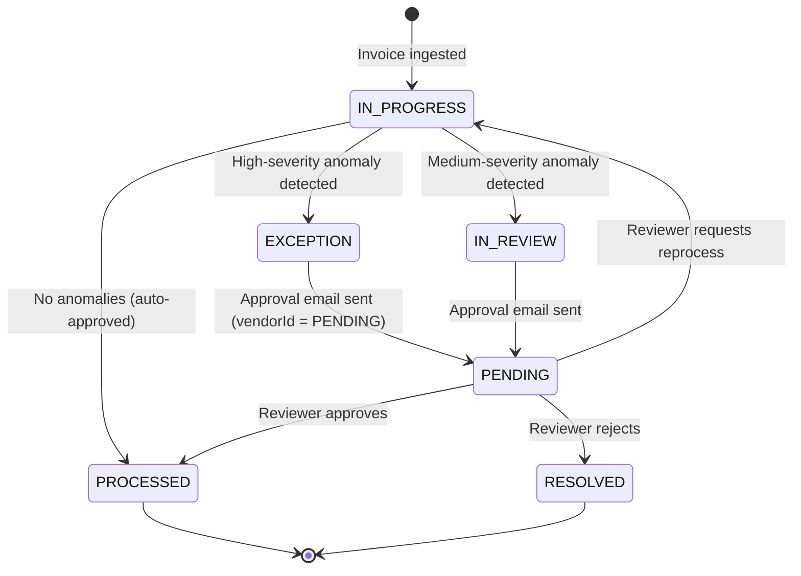

# AWS Invoice Pipeline — API Reference

> Complete REST API specification for the AWS Invoice Processing Pipeline.
> All endpoints are served via **Amazon API Gateway** and route to the
> `invoice-ingestion` or `approval-handler` Lambda functions.

---

## Table of Contents

- [Base Architecture](#-base-architecture)
- [Authentication & Security](#-authentication--security)
- [Common Headers](#-common-headers)
- [Standard Error Response](#-standard-error-response)
- [Invoice Status Lifecycle](#-invoice-status-lifecycle)
- [Endpoints](#endpoints)
  - [1. Ingestion — `POST /upload`](#-1-ingestion--post-upload)
  - [2. Email Callbacks — `GET /approve` · `GET /reject`](#-2-email-callbacks--get-approve--get-reject)
  - [3. Dashboard — `GET /dashboard`](#-3-dashboard--get-dashboard)
  - [4. Invoices — `GET /invoices` · `GET /invoices/{invoiceId}`](#-4-invoices--get-invoices--get-invoicesinvoiceid)
  - [5. Exceptions — `GET /exceptions`](#-5-exceptions--get-exceptions)
  - [6. Audit Logs — `GET /audit`](#-6-audit-logs--get-audit)
  - [7. Workflow Actions — `POST /approvals`](#-7-workflow-actions--post-approvals)
- [Data Models (TypeScript Schemas)](#-data-models-typescript-schemas)
- [DynamoDB Table Reference](#-dynamodb-table-reference)
- [Internal Contracts (Step Functions)](#-internal-contracts-step-functions)

---

## 🚀 Base Architecture

| Property | Value |
|---|---|
| **Protocol** | HTTPS / REST |
| **API Name** | `InvoicePipelineAPI-{env}` |
| **Stage** | Determined by the `Environment` SAM parameter (`dev` · `staging` · `prod`) |
| **Base URL** | `https://<api-id>.execute-api.<region>.amazonaws.com/<env>` |
| **Content-Type** | `application/json` (except email callback endpoints which return `text/html`) |
| **CORS** | Enabled for all origins (`*`), supporting `GET`, `POST`, `PUT`, `DELETE`, `OPTIONS` |
| **Throttling** | API Gateway default: 10,000 requests/sec (account level), 5,000 burst |

### Lambda Routing

| Lambda Function | Endpoints Handled |
|---|---|
| `invoice-ingestion-{env}` | `POST /upload` |
| `approval-handler-{env}` | All other endpoints (`/approve`, `/reject`, `/approvals`, `/invoices`, `/exceptions`, `/audit`, `/dashboard`) |

---

## 🔐 Authentication & Security

**Current implementation**: No API key or IAM authentication is enforced on the API Gateway endpoints. Access is controlled at the network level and via CORS headers only.

| Aspect | Detail |
|---|---|
| **API Keys** | Not required |
| **IAM Auth** | Not enabled on API Gateway resources |
| **CORS** | Fully open (`*` origin) — suitable for development. Restrict `AllowOrigin` to your Amplify domain in production. |
| **SES Email Auth** | Approval email links contain a Step Functions **task token** as a query parameter. The token acts as a one-time credential — it expires after the workflow completes or times out (72 hours). |

---

## 📋 Common Headers

### Request Headers

| Header | Required | Description |
|---|---|---|
| `Content-Type` | Yes (for POST) | `application/json` or `application/pdf` (for upload) |
| `X-Filename` | No | Original filename of the uploaded PDF (used by `POST /upload`) |
| `X-Invoice-Metadata` | No | JSON string with optional pre-filled fields: `vendorName`, `invoiceDate`, `poNumber`, `invoiceNumber`, `uploadedBy` |

### Response Headers (All Endpoints)

All responses include the following CORS headers:

```
Access-Control-Allow-Origin: *
Access-Control-Allow-Headers: Content-Type,Authorization,X-Requested-With,x-filename,x-invoice-metadata,X-Filename,X-Invoice-Metadata
Access-Control-Allow-Methods: GET,POST,PUT,DELETE,OPTIONS
Content-Type: application/json
```

### CORS Preflight

Every API path supports `OPTIONS` for CORS preflight. Preflight requests return `200 OK` with CORS headers and an empty body.

---

## ❌ Standard Error Response

All error responses follow a consistent JSON structure:

```json
{
  "error": "Human-readable error description",
  "message": "Detailed error message (optional, included for 500 errors)"
}
```

### Common HTTP Status Codes

| Code | Meaning | When Returned |
|---|---|---|
| `200` | Success | All successful requests |
| `400` | Bad Request | Missing required parameters (`invoiceId`, `token`, `action`, etc.) |
| `404` | Not Found | Invoice not found, or unmatched API path |
| `405` | Method Not Allowed | Non-POST request to `/upload` |
| `500` | Internal Server Error | Unhandled exceptions — includes `error` and `message` fields |

---

## 🔄 Invoice Status Lifecycle



### Status Reference

| Status | Badge Color | Meaning |
|---|---|---|
| `IN_PROGRESS` | 🟠 Orange | Currently being processed through the pipeline |
| `PROCESSED` | 🟢 Green | Successfully validated and persisted — no anomalies |
| `IN_REVIEW` | 🟠 Orange | Medium-severity anomaly — awaiting human review |
| `PENDING_REVIEW` | 🟡 Yellow | Queued for review but not yet assigned |
| `EXCEPTION` | 🔴 Red | High-severity anomaly detected — requires immediate attention |
| `RESOLVED` | 🔵 Blue | Exception reviewed and resolved (approved or rejected) |

---

## Endpoints

---

### 📂 1. Ingestion — `POST /upload`

Directly uploads an invoice PDF into the pipeline via the React dashboard.

**Lambda**: `invoice-ingestion-{env}`

#### Request

```bash
curl -X POST "https://<api-id>.execute-api.<region>.amazonaws.com/<env>/upload" \
  -H "Content-Type: application/pdf" \
  -H "X-Filename: invoice-acme-2026.pdf" \
  -H "X-Invoice-Metadata: {\"vendorName\":\"Acme Corp\",\"poNumber\":\"PO-1234\"}" \
  --data-binary @invoice.pdf
```

| Header | Required | Description |
|---|---|---|
| `Content-Type` | Yes | `application/pdf` (binary body is base64-encoded by API Gateway) |
| `X-Filename` | No | Original filename. Defaults to `invoice.pdf` if omitted. |
| `X-Invoice-Metadata` | No | JSON string with optional pre-filled metadata fields (see below) |

**X-Invoice-Metadata fields** (all optional):

| Field | Type | Description |
|---|---|---|
| `vendorName` | `string` | Pre-filled vendor name |
| `vendorId` | `string` | Pre-filled vendor ID |
| `invoiceNumber` | `string` | Pre-filled invoice number |
| `invoiceDate` | `string` | Pre-filled invoice date |
| `poNumber` | `string` | Purchase order number |
| `uploadedBy` | `string` | Name of the user performing the upload |

#### Success Response — `200 OK`

```json
{
  "success": true,
  "invoiceId": "INV-2026-A1B2C3D4",
  "message": "Invoice uploaded and processing started",
  "s3Key": "invoices/INV-2026-A1B2C3D4/invoice-acme-2026.pdf"
}
```

| Field | Type | Description |
|---|---|---|
| `success` | `boolean` | Always `true` on success |
| `invoiceId` | `string` | Generated ID in format `INV-{YEAR}-{8-CHAR-UUID}` |
| `message` | `string` | Human-readable confirmation |
| `s3Key` | `string` | S3 object key where the PDF was stored |

#### Error Responses

| Code | Body | Cause |
|---|---|---|
| `405` | `{ "error": "Method not allowed" }` | Non-POST request |
| `500` | `{ "error": "Upload failed", "message": "..." }` | S3 upload failure, DynamoDB write failure, or Step Functions start failure |

#### Side Effects

1. PDF stored in S3 bucket `invoice-pipeline-raw-{accountId}` at key `invoices/{invoiceId}/{filename}`
2. `InvoiceRecord` created in DynamoDB with status `IN_PROGRESS` and source `UPLOAD`
3. `AuditEntry` written with eventType `INGESTION`
4. Step Functions execution started with the `invoiceId`, `s3Bucket`, and `s3Key`

---

### 📝 2. Email Callbacks — `GET /approve` · `GET /reject`

Triggered via hyperlinks in SES approval emails. These endpoints resume the paused Step Functions workflow.

**Lambda**: `approval-handler-{env}`

#### `GET /approve`

```bash
curl "https://<api-id>.execute-api.<region>.amazonaws.com/<env>/approve?token=<taskToken>&invoiceId=INV-2026-A1B2C3D4"
```

#### `GET /reject`

```bash
curl "https://<api-id>.execute-api.<region>.amazonaws.com/<env>/reject?token=<taskToken>&invoiceId=INV-2026-A1B2C3D4"
```

#### Query Parameters

| Parameter | Required | Description |
|---|---|---|
| `token` | Yes | Step Functions task token (URL-encoded). Acts as a one-time credential. |
| `invoiceId` | Yes | ID of the invoice being reviewed |

#### Success Response — `200 OK`

Returns a rendered **HTML page** (not JSON) confirming the action. The `Content-Type` header is set to `text/html`.

The HTML page displays:
- ✅ or ❌ icon depending on action
- Confirmation message: "Invoice **{invoiceId}** has been approved/rejected successfully."
- "You can close this window." footer text

#### Error Responses

| Code | Body | Cause |
|---|---|---|
| `400` | `{ "error": "Missing token or invoiceId" }` | Missing required query parameters |
| `500` | `{ "error": "Failed to process callback" }` | Step Functions `SendTaskSuccess`/`SendTaskFailure` call failed (e.g., token expired) |

#### Side Effects

| Action | DynamoDB Update | Step Functions | Audit Entry |
|---|---|---|---|
| **Approve** | Status → `PROCESSED`, sets `approvedBy: "email-callback"` | `SendTaskSuccess` with approval payload | `APPROVAL` event |
| **Reject** | Status → `RESOLVED`, sets `approvalComments: "Rejected via email link"` | `SendTaskFailure` with error `REJECTED` | `REJECTION` event |

---

### 🛠️ 3. Dashboard — `GET /dashboard`

Retrieves aggregated statistics across the entire invoice database to power dashboard KPI cards.

**Lambda**: `approval-handler-{env}`

#### Request

```bash
curl "https://<api-id>.execute-api.<region>.amazonaws.com/<env>/dashboard"
```

No query parameters required.

#### Success Response — `200 OK`

```json
{
  "totalInvoices": 150,
  "processed": 120,
  "inProgress": 10,
  "exceptions": 15,
  "inReview": 3,
  "pendingReview": 2,
  "resolved": 0,
  "processedPercentage": "80.0",
  "exceptionPercentage": "10.0"
}
```

| Field | Type | Description |
|---|---|---|
| `totalInvoices` | `number` | Sum of all invoices across all statuses |
| `processed` | `number` | Count of `PROCESSED` invoices |
| `inProgress` | `number` | Count of `IN_PROGRESS` invoices |
| `exceptions` | `number` | Count of `EXCEPTION` invoices |
| `inReview` | `number` | Count of `IN_REVIEW` invoices |
| `pendingReview` | `number` | Count of `PENDING_REVIEW` invoices |
| `resolved` | `number` | Count of `RESOLVED` invoices |
| `processedPercentage` | `string` | `(processed / total × 100)` with 1 decimal place |
| `exceptionPercentage` | `string` | `(exceptions / total × 100)` with 1 decimal place |

> **Implementation note**: Each status count is fetched via a separate DynamoDB query on the `status-index` GSI. All 6 queries run in parallel for performance.

---

### 📄 4. Invoices — `GET /invoices` · `GET /invoices/{invoiceId}`

#### `GET /invoices`

Retrieves a paginated list of all invoices with optional status filtering.

```bash
# All invoices (default page size 25)
curl "https://<api-id>.execute-api.<region>.amazonaws.com/<env>/invoices"

# Filtered by status with custom page size
curl "https://<api-id>.execute-api.<region>.amazonaws.com/<env>/invoices?status=PROCESSED&pageSize=10"

# Pagination (pass lastKey from previous response)
curl "https://<api-id>.execute-api.<region>.amazonaws.com/<env>/invoices?lastKey=%7B%22invoiceId%22%3A%22INV-2026-A1B2C3D4%22%7D"
```

##### Query Parameters

| Parameter | Required | Default | Description |
|---|---|---|---|
| `status` | No | — | Filter by `InvoiceStatus`: `IN_PROGRESS`, `PROCESSED`, `IN_REVIEW`, `PENDING_REVIEW`, `EXCEPTION`, `RESOLVED` |
| `pageSize` | No | `25` | Maximum number of results per page |
| `lastKey` | No | — | URL-encoded JSON string of DynamoDB `LastEvaluatedKey` for cursor-based pagination |

##### Success Response — `200 OK`

```json
{
  "items": [
    {
      "invoiceId": "INV-2026-A1B2C3D4",
      "vendorId": "PENDING",
      "vendorName": "Acme Solutions Pvt. Ltd.",
      "vendorAddress": "123 MG Road, Bengaluru 560001",
      "gstin": "29AABCU9603R1ZM",
      "invoiceNumber": "INV-2026-9812",
      "invoiceDate": "2026-06-15",
      "dueDate": "2026-07-15",
      "poNumber": "PO-4567",
      "lineItems": [
        {
          "description": "AWS Training - Solutions Architect",
          "hsnSac": "998314",
          "quantity": 2,
          "unitPrice": 5000,
          "amount": 10000
        }
      ],
      "subtotal": 10000,
      "cgst": 900,
      "sgst": 900,
      "totalAmount": 11800,
      "currency": "INR",
      "status": "PROCESSED",
      "extractionConfidence": 97.8,
      "extractedFields": [],
      "anomalies": [],
      "createdAt": "2026-06-15T10:23:00Z",
      "updatedAt": "2026-06-15T10:25:30Z",
      "receivedOn": "2026-06-15T10:23:00Z",
      "s3RawKey": "invoices/INV-2026-A1B2C3D4/invoice.pdf",
      "source": "UPLOAD"
    }
  ],
  "total": 1,
  "hasMore": false
}
```

> **Note**: When `status` is provided, the query uses the `status-index` GSI. Otherwise, a full table scan is performed (limited by `pageSize`).

---

#### `GET /invoices/{invoiceId}`

Retrieves complete details of a specific invoice along with its full audit history.

```bash
curl "https://<api-id>.execute-api.<region>.amazonaws.com/<env>/invoices/INV-2026-A1B2C3D4"
```

##### Path Parameters

| Parameter | Required | Description |
|---|---|---|
| `invoiceId` | Yes | The ID of the target invoice (e.g., `INV-2026-A1B2C3D4`) |

##### Success Response — `200 OK`

```json
{
  "invoice": {
    "invoiceId": "INV-2026-A1B2C3D4",
    "vendorId": "PENDING",
    "vendorName": "Acme Solutions Pvt. Ltd.",
    "vendorAddress": "123 MG Road, Bengaluru 560001",
    "gstin": "29AABCU9603R1ZM",
    "invoiceNumber": "INV-2026-9812",
    "invoiceDate": "2026-06-15",
    "dueDate": "2026-07-15",
    "poNumber": "PO-4567",
    "invoiceType": "Standard",
    "lineItems": [
      {
        "description": "AWS Training - Solutions Architect",
        "hsnSac": "998314",
        "quantity": 2,
        "unitPrice": 5000,
        "amount": 10000
      }
    ],
    "subtotal": 10000,
    "cgst": 900,
    "sgst": 900,
    "totalAmount": 11800,
    "currency": "INR",
    "status": "PROCESSED",
    "extractionConfidence": 97.8,
    "extractedFields": [
      {
        "fieldName": "vendorName",
        "extractedValue": "Acme Solutions Pvt. Ltd.",
        "confidence": 98.5,
        "validationStatus": "MATCHED"
      },
      {
        "fieldName": "gstin",
        "extractedValue": "29AABCU9603R1ZM",
        "confidence": 99.1,
        "validationStatus": "MATCHED"
      }
    ],
    "anomalies": [],
    "approvedBy": "Admin User",
    "approvalTimestamp": "2026-06-15T11:00:00Z",
    "approvalComments": "Verified manually",
    "assignedTo": "reviewer",
    "createdBy": "web-user",
    "createdAt": "2026-06-15T10:23:00Z",
    "updatedAt": "2026-06-15T11:00:00Z",
    "receivedOn": "2026-06-15T10:23:00Z",
    "s3RawKey": "invoices/INV-2026-A1B2C3D4/invoice.pdf",
    "s3AuditKey": "audit/INV-2026-A1B2C3D4/pipeline-report-1718445600000.json",
    "s3ExtractedJsonKey": "textract/INV-2026-A1B2C3D4/raw-response.json",
    "source": "UPLOAD"
  },
  "auditLogs": [
    {
      "auditId": "a1b2c3d4-e5f6-7890-abcd-ef1234567890",
      "invoiceId": "INV-2026-A1B2C3D4",
      "event": "Invoice uploaded via web dashboard",
      "eventType": "INGESTION",
      "timestamp": "2026-06-15T10:23:00Z",
      "user": "web-user",
      "details": "PDF \"invoice.pdf\" uploaded via React dashboard",
      "metadata": {
        "filename": "invoice.pdf",
        "size": "245760"
      }
    },
    {
      "auditId": "b2c3d4e5-f6a7-8901-bcde-f12345678901",
      "invoiceId": "INV-2026-A1B2C3D4",
      "event": "Document extraction completed",
      "eventType": "EXTRACTION",
      "timestamp": "2026-06-15T10:23:15Z",
      "user": "system",
      "details": "Textract extracted 10 fields, 2 line items. Overall confidence: 97.8%",
      "metadata": {
        "fieldsCount": "10",
        "lineItemsCount": "2",
        "confidence": "97.8"
      }
    },
    {
      "auditId": "c3d4e5f6-a7b8-9012-cdef-123456789012",
      "invoiceId": "INV-2026-A1B2C3D4",
      "event": "AI validation completed",
      "eventType": "VALIDATION",
      "timestamp": "2026-06-15T10:23:30Z",
      "user": "system",
      "details": "Bedrock validation: PROCESSED. 0 anomalies detected. Confidence: 97.8%",
      "metadata": {
        "status": "PROCESSED",
        "anomaliesCount": "0",
        "anomalyTypes": "",
        "confidence": "97.8"
      }
    }
  ]
}
```

##### Error Responses

| Code | Body | Cause |
|---|---|---|
| `400` | `{ "error": "Missing invoiceId" }` | Empty or missing path parameter |
| `404` | `{ "error": "Invoice not found" }` | No record found in DynamoDB for the given `invoiceId` |

> **Implementation note**: The invoice is fetched using the composite key `(invoiceId, vendorId="PENDING")`. Audit logs are queried from the `AuditEntries` table using the `invoiceId-index` GSI.

---

### ⚠️ 5. Exceptions — `GET /exceptions`

Retrieves all invoices that have encountered anomalies or require manual review.

```bash
curl "https://<api-id>.execute-api.<region>.amazonaws.com/<env>/exceptions"
curl "https://<api-id>.execute-api.<region>.amazonaws.com/<env>/exceptions?pageSize=50"
```

#### Query Parameters

| Parameter | Required | Default | Description |
|---|---|---|---|
| `pageSize` | No | `25` | Maximum results per status query |

#### Success Response — `200 OK`

```json
{
  "items": [
    {
      "invoiceId": "INV-2026-B2C3D4E5",
      "vendorName": "Unknown Vendor",
      "totalAmount": 5400,
      "status": "EXCEPTION",
      "anomalies": [
        {
          "type": "VENDOR_NOT_FOUND",
          "description": "Vendor name is missing or could not be extracted from the invoice.",
          "severity": "HIGH"
        },
        {
          "type": "MISSING_GSTIN",
          "description": "GSTIN field is empty or not detected in the invoice.",
          "severity": "HIGH"
        }
      ],
      "extractionConfidence": 72.3
    }
  ],
  "total": 70,
  "stats": {
    "totalExceptions": 70,
    "pendingReview": 24,
    "inProgress": 18,
    "resolved": 28
  }
}
```

| Field | Type | Description |
|---|---|---|
| `items` | `InvoiceRecord[]` | Combined list of invoices from 4 status categories (see below) |
| `total` | `number` | Total count of all exception-related invoices |
| `stats.totalExceptions` | `number` | Same as `total` |
| `stats.pendingReview` | `number` | Count of `PENDING_REVIEW` invoices |
| `stats.inProgress` | `number` | Count of `IN_REVIEW` invoices |
| `stats.resolved` | `number` | Count of `RESOLVED` invoices |

> **Implementation note**: The endpoint queries 4 statuses in parallel — `EXCEPTION`, `IN_REVIEW`, `PENDING_REVIEW`, and `RESOLVED` — and concatenates the results. Each query is independently limited by `pageSize`.

---

### 📜 6. Audit Logs — `GET /audit`

Queries the audit log table for a specific invoice's complete event history.

```bash
curl "https://<api-id>.execute-api.<region>.amazonaws.com/<env>/audit?invoiceId=INV-2026-A1B2C3D4"
```

#### Query Parameters

| Parameter | Required | Description |
|---|---|---|
| `invoiceId` | Yes | The target invoice ID |

#### Success Response — `200 OK`

```json
{
  "entries": [
    {
      "auditId": "a1b2c3d4-e5f6-7890-abcd-ef1234567890",
      "invoiceId": "INV-2026-A1B2C3D4",
      "event": "Invoice uploaded via web dashboard",
      "eventType": "INGESTION",
      "timestamp": "2026-06-15T10:23:00Z",
      "user": "web-user",
      "details": "PDF \"invoice.pdf\" uploaded via React dashboard",
      "metadata": {
        "filename": "invoice.pdf",
        "size": "245760"
      }
    }
  ]
}
```

#### Audit Event Types

| Event Type | Description |
|---|---|
| `INGESTION` | Invoice received (via email or upload) |
| `EXTRACTION` | Textract/Bedrock document extraction completed |
| `VALIDATION` | Bedrock AI validation completed |
| `APPROVAL` | Invoice approved by a reviewer |
| `REJECTION` | Invoice rejected by a reviewer |
| `REPROCESS` | Invoice sent back for reprocessing |
| `PERSISTENCE` | Final pipeline results persisted to DynamoDB + S3 |
| `ERROR` | Pipeline error occurred at any stage |

#### Error Responses

| Code | Body | Cause |
|---|---|---|
| `400` | `{ "error": "Missing invoiceId query parameter" }` | No `invoiceId` provided |

---

### 🎯 7. Workflow Actions — `POST /approvals`

Submits a review decision from the React dashboard. Handles dynamic corrections to extracted fields.

**Lambda**: `approval-handler-{env}`

```bash
curl -X POST "https://<api-id>.execute-api.<region>.amazonaws.com/<env>/approvals" \
  -H "Content-Type: application/json" \
  -d '{
    "invoiceId": "INV-2026-A1B2C3D4",
    "action": "APPROVE",
    "taskToken": "AAAAKgAAAAIA...",
    "reviewer": "Admin User",
    "comments": "Fixed subtotal mismatch",
    "correctedFields": {
      "INV-2026-A1B2C3D4-Subtotal": "500.00",
      "INV-2026-A1B2C3D4-Vendor Name": "Acme Corp"
    }
  }'
```

#### Request Body

| Field | Type | Required | Description |
|---|---|---|---|
| `invoiceId` | `string` | Yes | Target invoice ID |
| `action` | `string` | Yes | One of: `APPROVE`, `REJECT`, `REPROCESS` |
| `taskToken` | `string` | No | Step Functions task token. If omitted, the handler **automatically retrieves it from DynamoDB** (looked up by `invoiceId` with `vendorId = "PENDING"`). |
| `reviewer` | `string` | No | Name of the reviewer performing the action |
| `comments` | `string` | No | Review comments |
| `correctedFields` | `Record<string, string>` | No | Field corrections (see format below) |

#### `correctedFields` Key Format

Keys **must** be prefixed with the invoice ID followed by a hyphen:

```
{invoiceId}-{fieldName}
```

**Supported field names** and their DynamoDB mappings:

| `correctedFields` Key Suffix | DynamoDB Field | Value Parsing |
|---|---|---|
| `Vendor Name` | `vendorName` | Stored as string |
| `GSTIN` | `gstin` | Stored as string |
| `Invoice Number` | `invoiceNumber` | Stored as string |
| `Invoice Date` | `invoiceDate` | Stored as string |
| `Due Date` | `dueDate` | Stored as string |
| `PO Number` | `poNumber` | Stored as string |
| `Total Amount` | `totalAmount` | Parsed as float (non-numeric chars stripped) |
| `Subtotal` | `subtotal` | Parsed as float (non-numeric chars stripped) |
| `tax` | `cgst` | Stored as string |

> **Important**: Only keys that start with the correct `invoiceId-` prefix are processed. Others are silently ignored.

#### Action Behaviors

| Action | DynamoDB Status | Step Functions | Anomalies | Audit Event |
|---|---|---|---|---|
| `APPROVE` | → `PROCESSED` | `SendTaskSuccess` (non-blocking — token expiry is tolerated) | Cleared (`[]`) | `APPROVAL` |
| `REJECT` | → `RESOLVED` | `SendTaskFailure` with error `REJECTED` (non-blocking) | Cleared (`[]`) | `REJECTION` |
| `REPROCESS` | → `IN_PROGRESS` | — (no Step Functions interaction) | Cleared (`[]`) | `REPROCESS` |

> **Note on expired tokens**: If the Step Functions task token has expired or is invalid, the handler logs a warning and proceeds with the DynamoDB update. The approval/rejection is **not blocked** by a stale token.

#### Success Response — `200 OK`

```json
{
  "success": true,
  "invoiceId": "INV-2026-A1B2C3D4",
  "action": "APPROVE",
  "message": "Invoice approved successfully"
}
```

#### Error Responses

| Code | Body | Cause |
|---|---|---|
| `400` | `{ "error": "Missing invoiceId or action" }` | Missing required body fields |
| `500` | `{ "error": "Approval action failed", "message": "..." }` | DynamoDB update or audit write failure |

#### Side Effects

1. DynamoDB record updated with new status, reviewer info, and any corrected field values
2. `AuditEntry` written to the audit table
3. SNS notification published to `InvoicePipelineNotifications-{env}` topic (non-blocking — failure is logged but does not cause a 500)

---

## 📦 Data Models (TypeScript Schemas)

### InvoiceRecord

The complete DynamoDB record for an invoice. Returned by `GET /invoices`, `GET /invoices/{invoiceId}`, and `GET /exceptions`.

```typescript
interface InvoiceRecord {
  // Keys
  invoiceId: string;         // PK — format: "INV-{YEAR}-{8-CHAR-UUID}"
  vendorId: string;          // SK — set to "PENDING" during processing

  // Core fields
  vendorName: string;
  vendorAddress?: string;
  gstin?: string;            // 15-character Indian GSTIN
  invoiceDate: string;
  dueDate?: string;
  poNumber?: string;
  invoiceNumber: string;
  invoiceType?: string;

  // Financial
  lineItems: LineItem[];
  subtotal: number;
  cgst: number;              // Central GST
  sgst: number;              // State GST
  totalAmount: number;
  currency: string;          // Default: "INR"

  // Processing metadata
  status: InvoiceStatus;
  extractionConfidence: number;  // 0–100
  extractedFields: ExtractedField[];
  anomalies: Anomaly[];

  // Approval
  approvedBy?: string;
  approvalTimestamp?: string;
  approvalComments?: string;
  assignedTo?: string;

  // Audit & traceability
  createdBy?: string;
  createdAt: string;         // ISO 8601
  updatedAt: string;         // ISO 8601
  receivedOn: string;        // ISO 8601

  // S3 references
  s3RawKey: string;
  s3AuditKey?: string;
  s3ExtractedJsonKey?: string;

  // Step Functions
  taskToken?: string;        // Stored for dashboard-initiated approvals
  executionArn?: string;

  // Source
  source: 'EMAIL' | 'UPLOAD';
  sourceEmail?: string;
}
```

### Supporting Types

```typescript
type InvoiceStatus =
  | 'IN_PROGRESS'
  | 'PROCESSED'
  | 'IN_REVIEW'
  | 'PENDING_REVIEW'
  | 'EXCEPTION'
  | 'RESOLVED';

type ExceptionType =
  | 'MISSING_GSTIN'
  | 'AMOUNT_MISMATCH'
  | 'VENDOR_NOT_FOUND'
  | 'DUPLICATE_INVOICE'
  | 'LOW_CONFIDENCE_SCORE';

interface LineItem {
  description: string;
  hsnSac: string;         // HSN/SAC code (Indian tax classification)
  quantity: number;
  unitPrice: number;
  amount: number;
}

interface ExtractedField {
  fieldName: string;
  extractedValue: string;
  confidence: number;      // 0–100
  validationStatus: 'MATCHED' | 'MISMATCH' | 'NOT_FOUND' | 'PENDING';
}

interface Anomaly {
  type: ExceptionType;
  description: string;
  severity: 'HIGH' | 'MEDIUM' | 'LOW';
  suggestedValue?: string;
}

interface AuditEntry {
  auditId: string;          // PK — UUID
  invoiceId: string;        // GSI PK
  event: string;
  eventType: AuditEventType;
  timestamp: string;        // ISO 8601 — also serves as GSI SK
  user: string;
  details: string;
  metadata?: Record<string, string>;
}

type AuditEventType =
  | 'INGESTION'
  | 'EXTRACTION'
  | 'VALIDATION'
  | 'APPROVAL'
  | 'REJECTION'
  | 'REPROCESS'
  | 'PERSISTENCE'
  | 'ERROR';

// POST /approvals request body
interface ApprovalCallbackPayload {
  invoiceId: string;
  action: 'APPROVE' | 'REJECT' | 'REPROCESS';
  taskToken: string;
  reviewer: string;
  comments?: string;
  correctedFields?: Record<string, string>;
}
```

---

## 🗄️ DynamoDB Table Reference

### InvoiceRecords-{env}

| Attribute | Type | Role |
|---|---|---|
| `invoiceId` | `S` | Partition Key (PK) |
| `vendorId` | `S` | Sort Key (SK) — set to `"PENDING"` during processing |
| `status` | `S` | GSI PK for `status-index` |
| `updatedAt` | `S` | GSI SK for `status-index` |
| `invoiceNumber` | `S` | GSI PK for `invoiceNumber-index` (used for duplicate detection) |

**Global Secondary Indexes**:
| Index Name | PK | SK | Projection | Used By |
|---|---|---|---|---|
| `status-index` | `status` | `updatedAt` | ALL | `GET /invoices?status=`, `GET /dashboard`, `GET /exceptions` |
| `invoiceNumber-index` | `invoiceNumber` | — | ALL | Duplicate invoice detection (Bedrock validator) |

### AuditEntries-{env}

| Attribute | Type | Role |
|---|---|---|
| `auditId` | `S` | Partition Key (PK) |
| `timestamp` | `S` | Sort Key (SK) |
| `invoiceId` | `S` | GSI PK for `invoiceId-index` |

**Global Secondary Indexes**:
| Index Name | PK | SK | Projection | Used By |
|---|---|---|---|---|
| `invoiceId-index` | `invoiceId` | `timestamp` | ALL | `GET /audit?invoiceId=`, `GET /invoices/{invoiceId}` (audit logs) |

---

## 🔧 Internal Contracts (Step Functions)

The `approval-handler` Lambda can also be invoked **directly** by Step Functions (not via API Gateway) to send approval emails. This happens during the `HumanApproval` state of the pipeline.

### Direct Invocation Payload

```json
{
  "action": "SEND_APPROVAL_EMAIL",
  "invoiceId": "INV-2026-A1B2C3D4",
  "vendorName": "Acme Solutions Pvt. Ltd.",
  "totalAmount": 11800,
  "anomalies": ["VENDOR_NOT_FOUND", "MISSING_GSTIN"],
  "taskToken": "AAAAKgAAAAIA...",
  "assignedTo": "reviewer",
  "assignedToEmail": "reviewer@example.com"
}
```

### Behavior

1. Stores the `taskToken` in DynamoDB (so the dashboard can later use it for `POST /approvals` without needing the token)
2. Discovers the API Gateway URL automatically (queries the API Gateway REST APIs, looking for `InvoicePipelineAPI-{env}`)
3. Sends an HTML email via SES with **Approve** and **Reject** links pointing to `GET /approve` and `GET /reject`
4. Returns `{ "success": true, "message": "Approval email sent successfully" }`

> **Graceful degradation**: If SES email delivery fails (e.g., unverified sandbox address), the error is logged but the function does **not** throw. Approval can still be performed from the dashboard UI.
